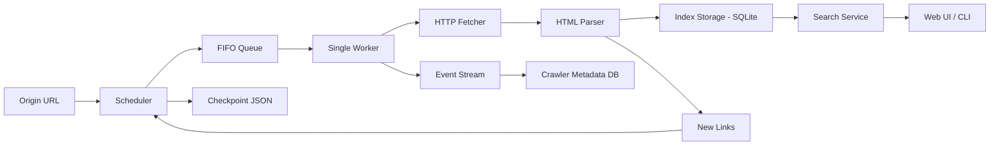

# CrawlDesk

Single-machine web crawler and search engine with a clean control panel.

CrawlDesk starts from an origin URL, traverses pages with **strict BFS**, indexes content into SQLite, and makes the data searchable in real time through both Web UI and CLI.

---

## Why CrawlDesk

CrawlDesk is intentionally built with a lightweight, transparent architecture:

- **Strict BFS traversal** for predictable crawl order.
- **Native Python HTTP + parsing stack** for full control and minimal dependency weight.
- **SQLite persistence** for durable indexing and restart-safe operations.
- **Live observability** through event logs, visited URL history, and crawler job tracking.

This gives you a crawler that is easy to understand, easy to extend, and reliable for coursework, demos, and production-style local workloads.

---

## Core Capabilities

- Create multiple crawler jobs from the UI or CLI.
- Crawl from an origin URL up to configurable depth/page limits.
- Prevent duplicate visits via normalized URL deduplication.
- Enforce queue backpressure with bounded FIFO queue.
- Apply request throttling with configurable requests-per-second.
- Index HTML pages into SQLite with upsert behavior.
- Run search while indexing continues.
- Persist jobs, events, indexed documents, and checkpoints across restarts.
- Delete individual crawlers or reset all data from the UI.

---

## System Architecture



### Component Map

- `crawler/`  
  Crawl orchestration, worker loop, fetch logic, rate limiting.
- `queue/`  
  Bounded FIFO queue and deduplicating scheduler.
- `index/`  
  SQLite document storage and search query backend.
- `search/`  
  Search service abstraction over index storage.
- `status/`  
  Runtime metrics and crawler state reporting.
- `web/`  
  Browser UI, crawler job manager, event/history views.
- `utils/`  
  URL normalization, link/title extraction, checkpoint persistence.

---

## Crawl Execution Model

1. Normalize origin URL.
2. Seed scheduler with depth `0`.
3. Consume queue in FIFO order with a single worker.
4. Fetch page with timeout + compression support.
5. Accept HTML content, extract links/title, index document.
6. Normalize discovered links and enqueue with `depth + 1`.
7. Persist events and checkpoints continuously.
8. Stop on queue exhaustion or page budget completion.

This model guarantees strict breadth-first traversal order.

---

## Data Persistence

CrawlDesk stores durable state under `data/`:

- `data/index.sqlite3`  
  Indexed documents used by search.
- `data/crawler_meta.sqlite3`  
  Crawler jobs and human-readable event stream.
- `data/checkpoints/<crawler_id>.json`  
  `seen` set + pending queue snapshot for restart continuity.

Result: you can stop and restart the app without losing indexed knowledge or crawler history.

---

## Web Interface

Main pages:

- `/crawler/new` -> create crawlers and review recent jobs
- `/search` -> Google-style search page with optional domain filter
- `/status` -> crawler list, detailed logs, visited URLs, lifecycle metadata

UI is fully English, dark-mode first, and tuned for operational clarity.

---

## Installation & Run

```bash
cd crawldesk
python -m venv .venv
```

Activate the virtual environment with the command appropriate for your shell, then run:

```bash
python -m pip install --upgrade pip
pip install -r requirements.txt
python app.py
```

Open:
- `http://127.0.0.1:8080/crawler/new`
- `http://127.0.0.1:8080/search`
- `http://127.0.0.1:8080/status`

---

## CLI Commands

### Start full web app

```bash
python app.py
```

Optional:

```bash
python app.py start --open-browser
python app.py start --port 8090
```

### Start via Python module

```bash
python app.py start
```

### Run an indexing job

```bash
python app.py index \
  --origin https://www.python.org \
  --max-depth 1 \
  --max-pages 30 \
  --no-resume
```

### Search indexed data

```bash
python app.py search \
  --query tutorial \
  --limit 10 \
  --domain python.org
```

### Runtime status

```bash
python app.py status
```

---

## Project Structure

```text
.
├── app.py
├── data/
├── product_prd.md
├── README.md
├── requirements.txt
├── run.bat
├── run.ps1
├── run.sh
├── src/
│   └── webcrawler/
│       ├── app.py
│       ├── main.py
│       ├── config.py
│       ├── crawler/
│       ├── index/
│       ├── queue/
│       ├── search/
│       ├── status/
│       ├── utils/
│       └── web/
└── tests/
```

---

## Technical Decisions (and Why)

- **SQLite + WAL mode**  
  Reliable local persistence with concurrent read/write behavior and simple deployment.
- **Strict BFS with single queue consumer**  
  Deterministic traversal order, easier debugging, and predictable crawl analytics.
- **Bounded queue + backpressure**  
  Prevents memory blowups under high-link pages.
- **Native `urllib` and `html.parser`**  
  Keeps the crawler auditable and dependency-light.
- **Event logging per crawler run**  
  Makes operations observable and user-facing status meaningful.

---

## Test

```bash
python -m unittest discover -s tests -p "test_*.py" -v
```

---

## Author

Built by **istemihan**.
